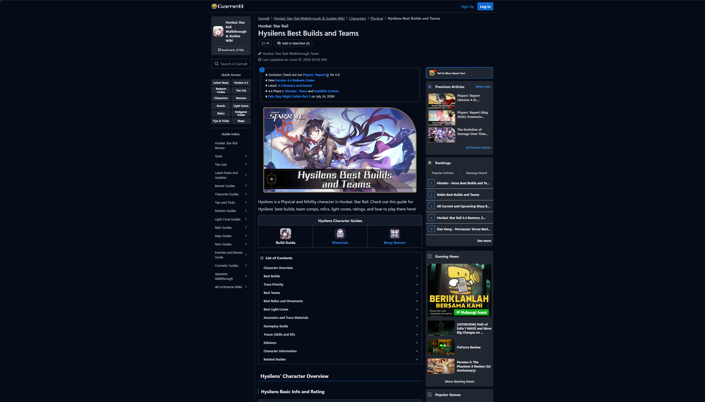
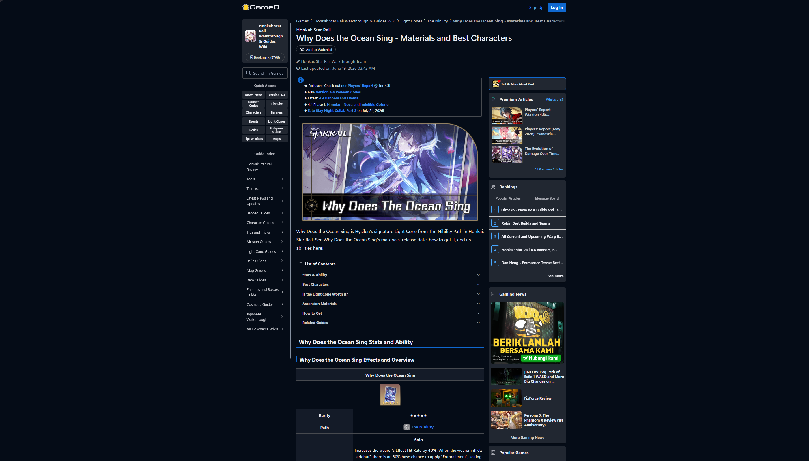
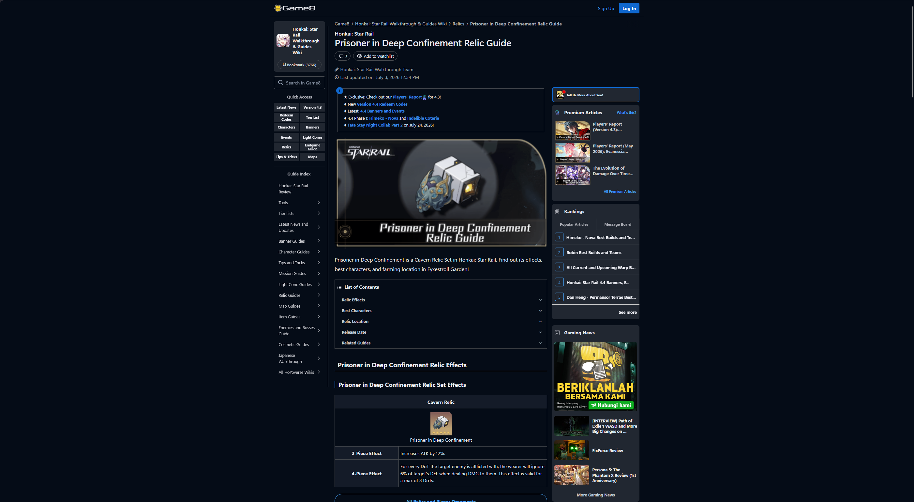
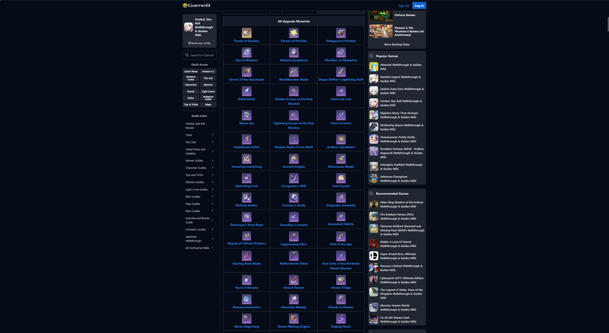

<h1 align="center">
   
  Seleksi Warga Basdat 2026  
  ETL Project
   
   

## Author

- **Nama:** Natanael I Manurung
- **NIM:** 13524021

## Deskripsi Singkat

**Data & DBMS:**
Data yang diambil adalah data karakter, light cone, relic, dan material dari game Honkai Star Rail. DBMS yang digunakan adalah PostgreSQL. Data akan diambil dari website game8.co, website guide yang berisikan data data tertera. Dikarenakan ini adalah website guide, data yang ditarik bukan hanya data data masing masing entity saja. Terdapat rekomendasi rekomendasi pairing, antara karakter dan LC, karakter dan Relic, dan pairing lainnya yang akan tercantum pada database.

**Mengapa memilih topik tersebut:**
Selain dari ketertarikan pribadi terhadap topik ini, data yang ditarik saling berkaitan, jumlahnya yang banyak, dan informasi yang bersifat widely available menurut saya menjadi salah satu contoh terbaik terhadap pengaplikasian tugas data scraping. Mengapa memilih website game8.co? Karena data datanya paling "cocok" adanya disitu, meski pada awalnya mau menggunakan prydwen.gg, namun web yang kompleks dan cloudflare yang agresif mengakibatkan beautifulsoup terlalu kewalahan dalam melakukan webscraping. Struktur game8.co "mostly" konsisten, tapi tetap dihadapi beberapa masalah terkait konsistensi baik pada struktur web atau dari data yang tercantum

## Cara Menggunakan Scraper dan Output-nya

**Menjalankan Scraper:**

1. Pastikan credential postgres (username, password, port) sudah tepat di `main.py`
2. Install dependencies: `pip install -r requirements.txt`
3. Jalankan script utama: `python main.py`

**Menggunakan Output:**

- Hasil scraping akan disimpan dalam folder `Data Scraping/data/` dalam bentuk file JSON.
- Secara otomatis, `main.py` akan menjalankan query dari `schema.sql` dan loading data dari JSON ke dalam PostgreSQL.

## Struktur File JSON

Berikut adalah struktur dari file JSON yang dihasilkan oleh scraper di folder `Data Scraping/data/`:

- **characters.json:** Kumpulan data karakter berupa _List of Dictionary_ yang berisi atribut `name`, `archive_id`, `url`, `basic_info` (rarity, path, element), `base_stats` (HP, ATK, DEF, SPD untuk level 1 dan 80), `best_build` (rekomendasi light cone, relic, dan main stats), `recommended_stats` (sub-stats priority), serta `total_materials` (material ascension dan traces).
- **light_cone.json:** Kumpulan data Light Cone berupa _List of Dictionary_ yang memuat `name`, `archive_id`, `url`, `basic_info` (rarity, path), `base_stats` (HP, ATK, DEF level 1 dan 80), `passive_skill` (nama dan deskripsi pasif), dan `total_materials` (kebutuhan material ascension).
- **relic.json:** Kumpulan data Relic dan Planar berupa _List of Dictionary_ yang meliputi `name`, `archive_id`, `url`, `type` (relic atau planar), dan `set_effects` (deskripsi efek 2-piece dan 4-piece).
- **materials.json:** Daftar material berupa _List of Dictionary_ yang berisi `name`, `rarity` (rating bintang), dan `type` (kategori seperti currency, ascension_mat, atau trace_mat).

## Struktur ERD dan Diagram Relasional

Pada skema kita akan selalu berpusat pada 4 entity utama: Character, Light Cone, Relic, dan Materials. Rekomendasi penggunaan suatu barang (char - LC, char - Relic, dsb) beserta dengan keterikatan material yang digunakan untuk upgrade char atau LC semua akan kita tuliskan dalam sebuah weak entity relation berisikan key dari kedua entity yang bersangkutan. Untuk memunculkan adanya relasi antara char dan LC yang digunakannya sekarang, ditambahkan empat relasi/entity active_char, active_lc, active_relic, dan team sebagai hub dari relasi relasi "active" tersebut. Team ini akan menjadi representasi tim yang aktif digunakan player berisikan kit yang benar benar digunakannya.

- **ERD:**
  
- **Diagram Relasional:**
  

## Proses Translasi ERD ke Diagram Relasional

### 1. Strong entity -> Tabel dengan Primary Key Tunggal

Strong entity kuat pada ERD (Character, Light Cone, Relics/relic_set, Element, Path, Stat, material, team) ditranslate menjadi satu tabel dengan surrogate key (serial) sebagai primary key, misalnya character_id, light_cone_id, relic_set_id. Atribut natural seperti archive_id (hasil scraping) tetap disimpan sebagai unique key alternatif untuk keperluan traceability terhadap sumber data dari scraping, bukan sebagai PK utama.

### 2. Relasi One-to-Many -> Foreign Key pada Sisi "Many"

Relasi seperti Part of (Character/Light Cone → Path) dan Holds (Character → Element) ditranslate menjadi kolom foreign key pada tabel di sisi "many":

character.path_id dan character.element_id
light_cone.path_id

Pola yang sama berlaku pada relasi When Obtained (Character → Active_Char, Light Cone → Active_LC), di mana active_character.character_id dan active_character.equipped_lc_id menjadi FK yang menunjuk ke entitas induknya.

### 3. Relasi Many-to-Many -> Tabel Junction

Setiap relasi many-to-many pada ERD (Recommended, Needs) ditranslate menjadi tabel junction tersendiri dengan composite primary key dari kedua FK yang terlibat, ditambah atribut milik relasi itu sendiri:

Character Needs Material (atribut Amount) -> character_ascension_material dan character_trace_material (dipisah berdasarkan type material agar query lebih spesifik)
Light Cone Needs Material -> light_cone_ascension_material
Character Recommended Light Cone (atribut Order) -> character_recommended_lc dengan kolom priority_rank
Character Recommended Relics -> character_recommended_relic dengan kolom priority_rank

Karena satu relasi Recommended pada ERD digambar generik untuk beberapa pasangan entitas berbeda (Relics, Light Cone, Sub Stat), masing-masing decompose menjadi tabel junction terpisah agar tidak ambigu secara relasional.

### 4. Weak Entity -> Tabel dengan Composite Key yang Mengandung FK strongnya

Entitas Sub Stat pada ERD sebenarnya adalah representasi relasi many-to-many antara Character dan Stat (via relasi Detailed) yang memiliki atribut order. Ini ditranslate menjadi dua tabel:

character_sub_stat_priority (composite PK: character_id, stat_id)
character_main_stat (composite PK: character_id, slot, stat_id), karena satu karakter punya prioritas stat berbeda untuk tiap slot gear.

### 5. Relasi Generalisasi/ISA -> Single Table dengan Kolom Diskriminator

Generalisasi Material IS A {Ascension Mats, Trace Mats, Currency Mats} tidak ditranslate menjadi tabel terpisah per subtipe, melainkan digabung menjadi satu tabel material dengan kolom type (ascension_mat | trace_mat | currency) sebagai diskriminator. Pendekatan ini dipilih karena seluruh subtipe berbagi struktur atribut yang identik (name, rarity), sehingga pemisahan tabel hanya akan menambah kompleksitas join tanpa manfaat.

### 6. Relasi One-to-One -> FK Nullable dengan Unique Constraint

Relasi Uses antara Active_Char dan Active_LC ditranslate sebagai FK nullable pada tabel active_character (equipped_lc_id), karena satu karakter aktif bisa saja belum memiliki Light Cone terpasang. Constraint tambahan (lc_superimposition wajib diisi jika equipped_lc_id tidak NULL) tidak bisa diekspresikan murni lewat DDL relasional, sehingga diimplementasikan melalui trigger (trg_check_lc_superimposition).

### 7. Constraint yang Tidak Bisa Direpresentasikan Secara Struktural -> Trigger

Beberapa aturan pada catatan ERD ("Asumsi") tidak bisa dinyatakan lewat kolom atau FK biasa, sehingga diimplementasikan sebagai trigger PostgreSQL:

trg_check_relic_type: memastikan effect_4pc wajib diisi untuk relic_set.type = 'relic' dan harus NULL untuk type = 'planar'.
trg_check_lc_superimposition: memastikan lc_superimposition terisi jika dan hanya jika equipped_lc_id tidak NULL.

## Screenshots Program

Screenshot hasil query di DBMS (SELECT FROM WHERE)

Screenshot hasil query character

## Penggunaan AI

Penggunaan AI terbatas terhadap bagaimana baiknya melakukan web scraping menggunakan beautiful soup. Dikarenakan ini modul yang baru saya pelajari, AI digunakan untuk melakukan drilling pribadi terhadap konsep konsep web scraping pada beautiful soup.
Semua pengerjaan coding, penyusunan skema, dan pengimplementasian database di postgres saya lakukan pribadi.

## Referensi

Char Page

LC Page

Relic Page

Material Page

